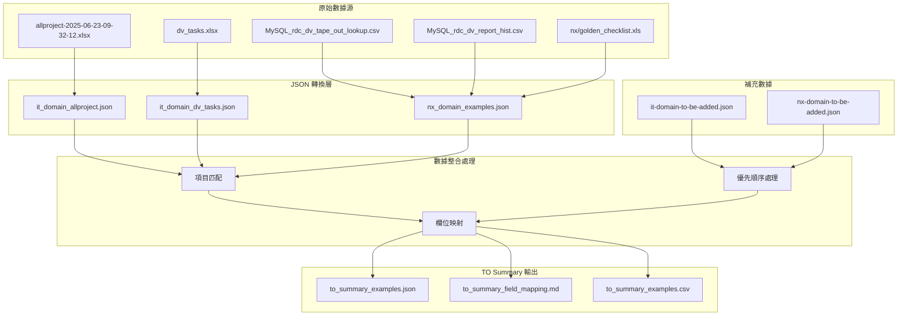
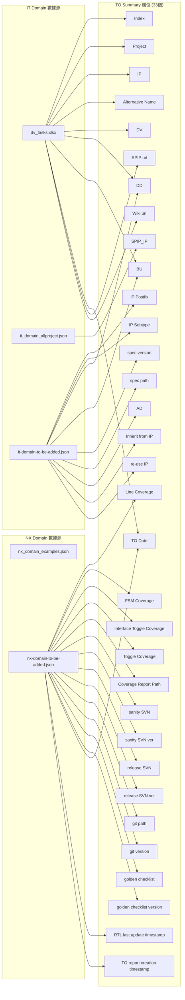
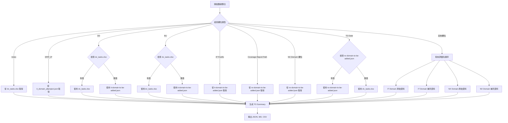
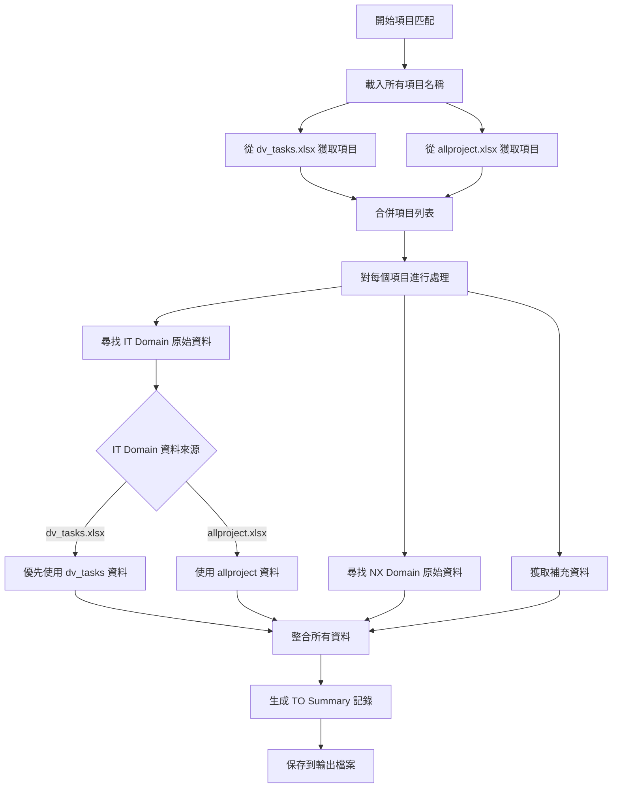

# TO Summary 數據來源流程圖

## 數據來源架構

## 詳細欄位來源映射

## 優先順序規則

## 項目匹配邏輯

## 數據流程總結

1. **原始數據收集**: 從多個 Excel 和 CSV 檔案收集原始數據
2. **JSON 轉換**: 將原始數據轉換為結構化的 JSON 格式
3. **補充數據**: 手動填寫額外的補充資訊
4. **項目匹配**: 根據項目名稱匹配不同來源的數據
5. **優先順序處理**: 按照預定義的優先順序規則整合數據
6. **欄位映射**: 將來源數據映射到 TO Summary 的 33 個標準欄位
7. **輸出生成**: 產生 JSON、Markdown 和 CSV 格式的結果

這個流程確保了數據的完整性和一致性，同時提供了清晰的數據來源追蹤。 